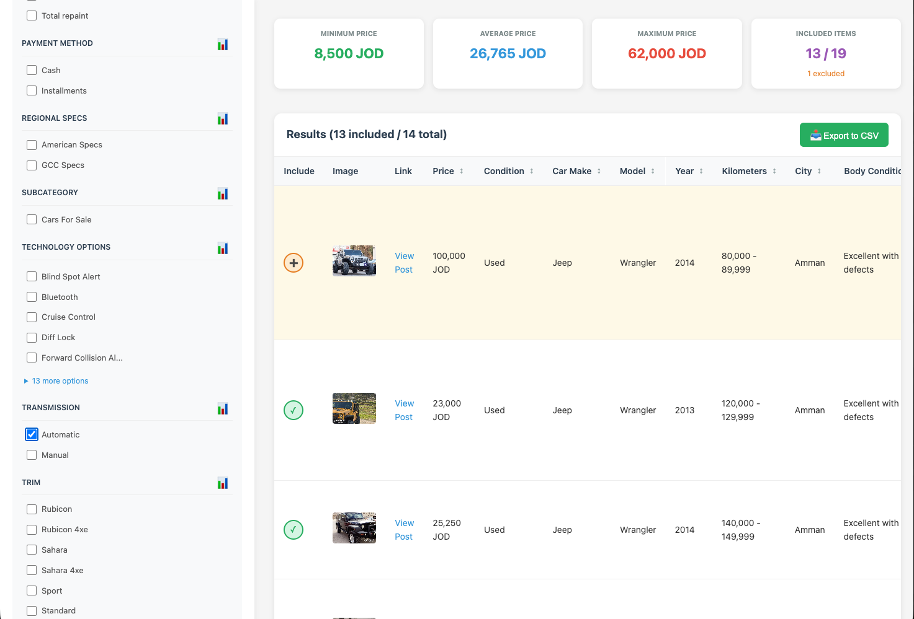

# OpenSooq Listings Analyzer

A full-stack application to analyze pricing data on OpenSooq listings.



## Features

- Input an OpenSooq search URL to fetch listings
- Scrapes detailed information for each listing including:
  - Price
  - Attributes (Make, Model, Year, Kilometers, etc.)
- Displays min, average, and max prices
- Filter listings by any attribute to see how prices change
- View all data in a sortable table with links to original posts

## Setup

```bash
# Install all dependencies
npm run install:all

# Run in development mode (starts both backend and frontend)
npm run dev
```

The frontend will run on http://localhost:3000
The backend API will run on http://localhost:3001

## Usage

1. Go to OpenSooq and search for items with your desired criteria
2. Copy the search URL (e.g., `https://jo.opensooq.com/en/cars/cars-for-sale/jeep/wrangler`)
3. Paste the URL in the input field and click "Analyze"
4. Wait for the scraping to complete
5. View the price statistics and use filters to analyze the data

## Tech Stack

- **Backend**: Node.js, Express, TypeScript, Axios, Cheerio
- **Frontend**: React, TypeScript, Vite

## ⚠️ Disclaimer

This project was completely written by Claude Opus 4.5.

This project is provided for **educational and research purposes only**.

- The author is not responsible for any misuse of this software or any legal consequences arising from its use.
- This tool is not affiliated with, endorsed by, or sponsored by OpenSooq.
- Users are solely responsible for ensuring their use of this tool complies with OpenSooq's Terms of Service, robots.txt, and all applicable local, national, and international laws.
- Web scraping may violate the terms of service of some websites. Always check and respect a website's terms before scraping.
- Use this tool responsibly and ethically. Do not use it to overload servers, collect personal data without consent, or for any malicious purposes.

By using this software, you agree to assume all responsibility for your actions.
